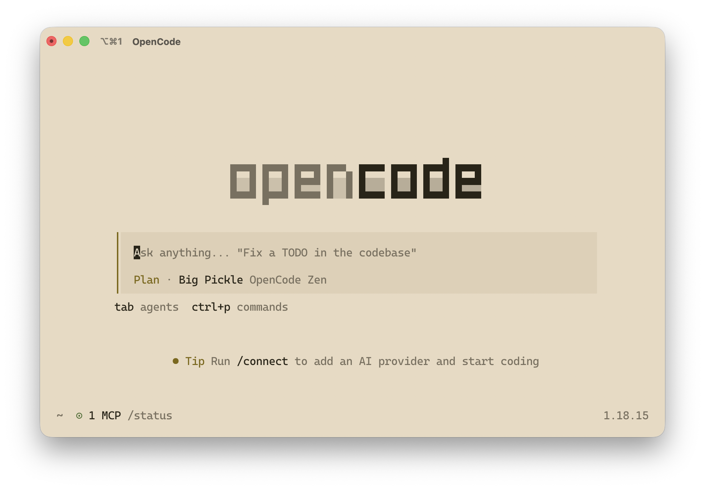
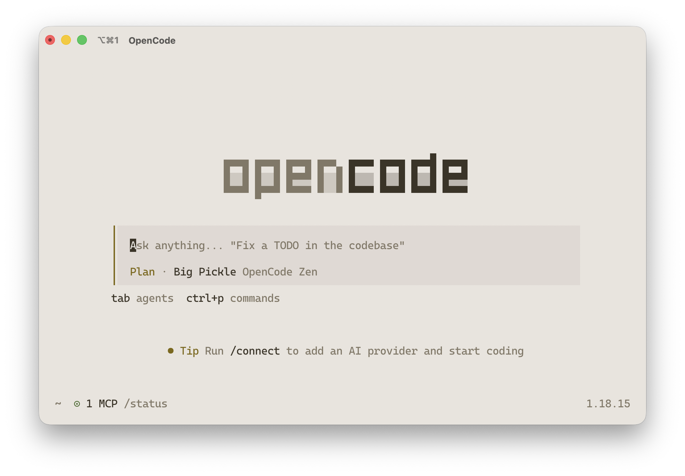

<p align="center">
  
</p>

<h1 align="center">Ember for opencode</h1>

<p align="center">
  <em>Ember color themes for your terminal AI coding agent</em>
</p>

<p align="center">
  <a href="https://github.com/ember-theme/ember">Palette & Docs</a> ·
  <a href="https://embertheme.com">embertheme.com</a>
</p>

---

## Variants

| Variant | Background | File |
|---|---|---|
| **Ember** | `#1c1b19` — dark graphite | `ember.json` |
| **Ember Soft** | `#242320` — lifted graphite | `ember-soft.json` |
| **Ember Light** | `#e6dac4` — warm ivory | `ember-light.json` |
| **Ember Lighter** | `#e8e4de` — pale warm gray | `ember-lighter.json` |

## Install

Run the install script:

```bash
curl -fsSL https://raw.githubusercontent.com/ember-theme/opencode/main/install.sh | bash
```

Or clone and run manually:

```bash
git clone https://github.com/ember-theme/opencode.git
cd opencode
chmod +x install.sh
./install.sh
```

### Set as default theme

After installing, add this to `~/.config/opencode/tui.json`:

```json
{
  "$schema": "https://opencode.ai/tui.json",
  "theme": "ember"
}
```

Replace `ember` with `ember-soft`, `ember-light`, or `ember-lighter` for other variants.

## Showcase

<details>
<summary><b>Ember</b> — <code>#1c1b19</code> dark graphite</summary>


</details>

<details>
<summary><b>Ember Soft</b> — <code>#242320</code> lifted graphite</summary>


</details>

<details>
<summary><b>Ember Light</b> — <code>#e6dac4</code> warm ivory</summary>



</details>

<details>
<summary><b>Ember Lighter</b> — <code>#e8e4de</code> pale warm gray</summary>



</details>

## License

MIT — ember-theme
